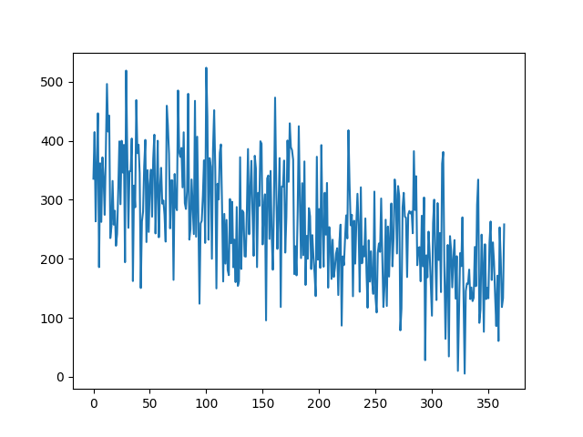

**Algorithm for the longest increasing subset of a sequence of integers**

The problem: given a finite sequence of integers, we want to extract a subset of the 
sequence that is strictly increasing and has the longest length.

Example: given [1, 3, 0, 7, 5], we want [1, 3, 5] or [1, 3, 7] as these are the 
only two subsets of length 3 that are strictly increasing.

The subtlety that makes the problem "hard": the subset does not need to consist of
consecutive values in the input sequence (ordering must be preserved though).
So this isn't just about "slicing" or "sorting" an array.

Content of this directory:
- `increasing-subset.cpp`: C++ program containing various algorithms for solving the problem;
- `generate.py`: a Python script for generating "random" integer sequences that can be used as input for the algorithms;
- `redraw.py`: a Python script to plot the values generated previously, with the result of the algorithms drawn on top.

Various algorithms written in C++ are proposed here to tackle this problem.

`compute_length_of_longest_increasing_subset()` computes the maximum length of 
strictly increasing subsets that can be extracted from the input sequence.

`build_all_increasing_subsets()` builds all the possible subsets.
Getting one of maximum length is thereafter trivial.

Both of these algorithms have terrible algorithmic complexity as they 
enumerate all the possibilities, and are therefore not suitable for use 
with input sequences of moderate or large size.

With `build_increasing_subsets_candidates()`, the problem is solved by 
recursively building a list of candidates, one for each length, and 
discarding subsets that are redundant (in the sense that they will 
not be able to produce longer subsets).

The two python scripts are used to generate and plot the input sequence, as 
well as plotting the result of the C++ algorithms.
They are not usable "out of the box" and need to be manually edited 
to change their output.

**Results**

Given the following input of 64 integers:

The algorithm extracts the following 9 points:

Given the following input of 365 integers:

The algorithm extracts the following 24 points:

